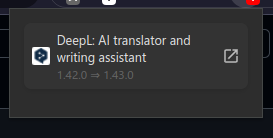
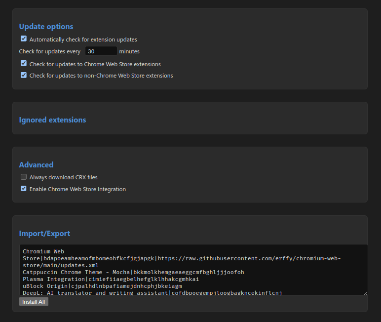

> [!IMPORTANT]
> This project is inspired by the extension made by [NeverDecaf](https://github.com/NeverDecaf), and the code has been modified from [there](https://github.com/NeverDecaf/chromium-web-store).

## Chromium Web Store

⚡ Enables installing Chrome Web Store extensions and semi-automatic updates in **Ungoogled Chromium**.

---

### 🧩 Features

- ✅ **Install** extensions from the Chrome Web Store
- 🔄 **Check for updates** to installed extensions
- ⚠️ **View removed or failed extensions**
- 🌍 **Multilingual interface** via `chrome.i18n`
- 🔒 Works with Ungoogled Chromium (no web store login required)

---

### 📥 Installation

1. Open `chrome://flags`  
   Search for `#extension-mime-request-handling` and set it to **Always prompt for install**  
   _(This enables .crx installation prompts)_

2. Go to the [Releases](https://github.com/erffy/chromium-web-store/releases/latest) page  
   Download the latest `store.crx` file — you should be prompted to install it.

> If not prompted, you can also drag & drop the `.crx` file into `chrome://extensions/`

Alternatively, load it manually:

1. Download the repo and unzip it  
2. Open `chrome://extensions/`  
3. Enable **Developer Mode**  
4. Click **"Load unpacked"** and select the folder

---

### 📷 Screenshots

#### ⚡ Popup Window  

#### 🔧 Options Page  

---

### 🛠 How It Works

- Checks installed extensions for available updates
- Displays version changes like: `1.0.2 ⇒ 1.1.0`
- Lets you trigger updates manually
- Highlights removed or failed updates

---

### 🌐 Localization

All interface text is localized using `chrome.i18n`.  
To add a new language:

1. Create a folder in `_locales/` (e.g. `tr`, `fr`)
2. Add a `messages.json` with your translations

---

### 🤔 Why?

Ungoogled Chromium blocks Web Store integration by default.  
This extension restores essential extension management — **manually and transparently.**

---

### 📄 License

This project is licensed under the **GNU General Public License v3.0**  
See [`LICENSE`](LICENSE) for details.